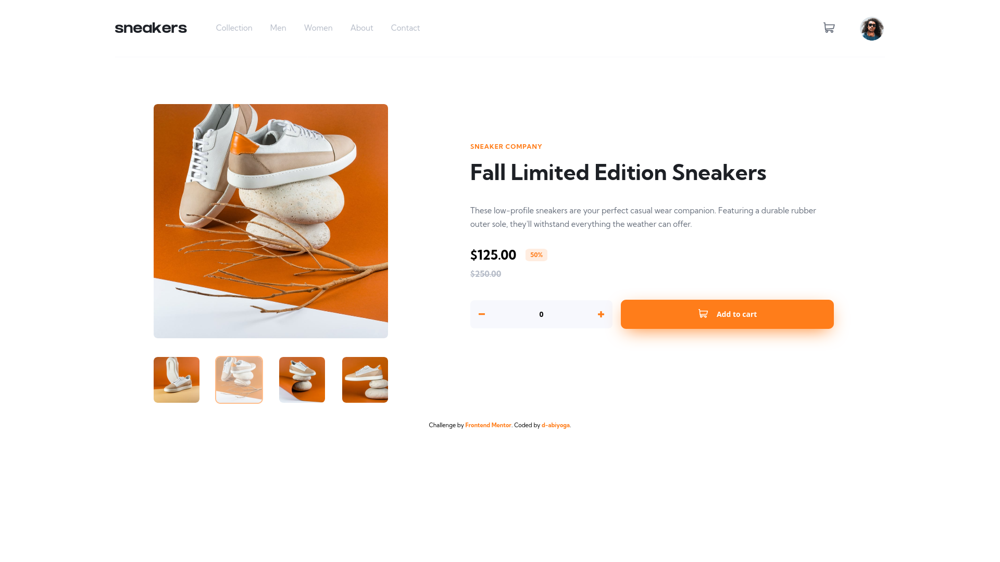

# Frontend Mentor - E-commerce product page solution

This is a solution to the [E-commerce product page challenge on Frontend Mentor](https://www.frontendmentor.io/challenges/ecommerce-product-page-UPsZ9MJp6). Frontend Mentor challenges help you improve your coding skills by building realistic projects.

## Table of contents

- [Overview](#overview)
  - [The challenge](#the-challenge)
  - [Screenshot](#screenshot)
  - [Links](#links)
- [My process](#my-process)
  - [Built with](#built-with)
  - [What I learned](#what-i-learned)
  - [Continued development](#continued-development)
  - [Useful resources](#useful-resources)
- [Author](#author)

## Overview

### The challenge

Users should be able to:

- View the optimal layout for the site depending on their device's screen size
- See hover states for all interactive elements on the page
- Open a lightbox gallery by clicking on the large product image
- Switch the large product image by clicking on the small thumbnail images
- Add items to the cart
- View the cart and remove items from it

### Screenshot

### Links

- Solution URL: [solution](https://www.frontendmentor.io/solutions/ecommerce-product-page-with-reactjs-WgoDEBPds)
- Live Site URL: [live site hosted in Netlify](https://ecommerce-product-page-d-abiyoga.netlify.app/)

## My process

### Built with

- Semantic HTML5 markup
- CSS custom properties
- Flexbox
- CSS Grid
- Mobile-first workflow
- [React](https://reactjs.org/) - JS library
- uuid - JS library
- react-swipeable  

### What I learned

This challenge is a quite hard since I introduced with UI components I never built before. I learned how to build lightbox and carousel.I also try to be more concious to accessibility and keyboard users who may use keyboard only in the carousel.

I learned to use React props to implement the functionality of toggler and cart items. 

I use react-swipeable to accomodate swipe in carousel which is a common user behavior in mobile version.

### Continued development

The code may be refactored after I learned more React hooks which may make cleaner code such as useContext.

Better lazy-loading may also be applied in further improvement.

### Useful resources
[Learn how to create slider.](https://youtu.be/og3wCO98HkQ?list=LL) this help me thbuilding simple slider.

## Author

- Frontend Mentor - [@d-abiyoga](https://www.frontendmentor.io/profile/d-abiyoga)

