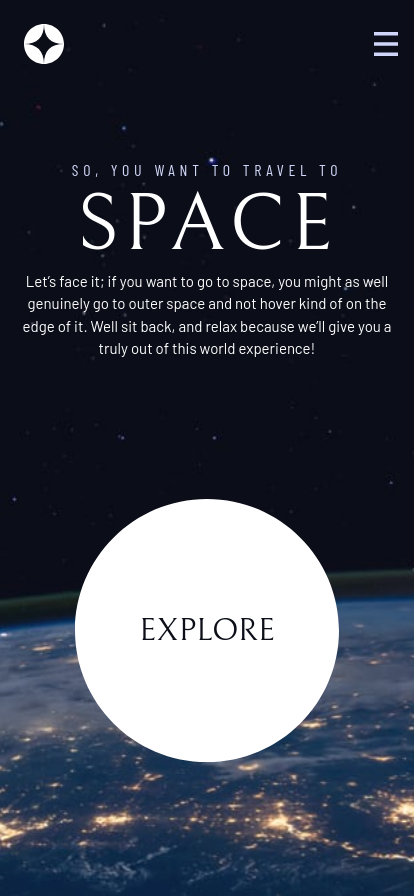
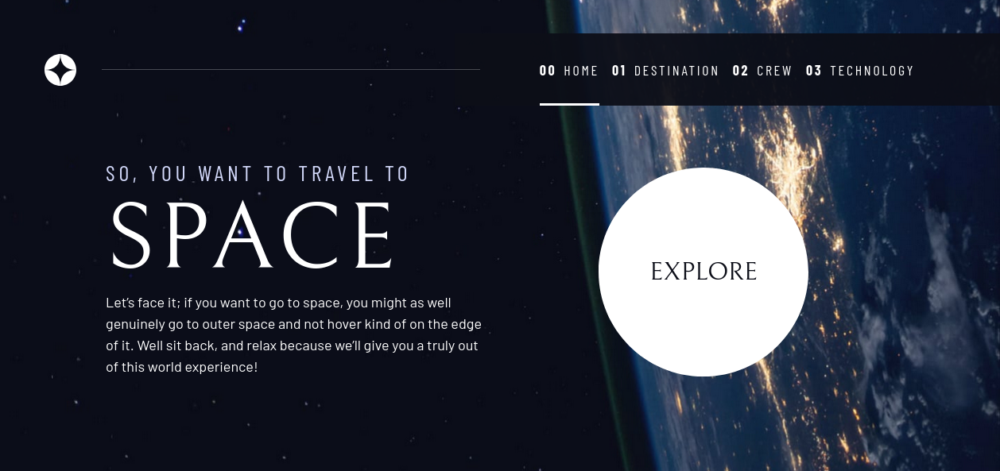

# Frontend Mentor - Space tourism website solution

This is a solution to the [Space tourism website challenge on Frontend Mentor](https://www.frontendmentor.io/challenges/space-tourism-multipage-website-gRWj1URZ3). Frontend Mentor challenges help you improve your coding skills by building realistic projects. 

## Table of contents

- [Overview](#overview)
  - [The challenge](#the-challenge)
  - [Screenshot](#screenshot)
  - [Links](#links)
- [My process](#my-process)
  - [Built with](#built-with)
  - [What I learned](#what-i-learned)
  - [Continued development](#continued-development)
  - [Useful resources](#useful-resources)
- [Author](#author)

## Overview

### The challenge

Users should be able to:

- View the optimal layout for each of the website's pages depending on their device's screen size
- See hover states for all interactive elements on the page
- View each page and be able to toggle between the tabs to see new information

### Screenshot

### Links

- Solution URL: [solution URL](https://www.frontendmentor.io/solutions/space-tourism-web-with-vanillajs-css-grid-6Xbfj4-O7)
- Live Site URL: [Live Site on netlify](https://space-travel-web-d-abiyoga.netlify.app/)

## My process

### Built with

- Semantic HTML5 markup
- CSS custom properties
- Flexbox
- CSS Grid
- Vanilla JS

**Note: These are just examples. Delete this note and replace the list above with your own choices**

### What I learned

In this challenge I use Kevin Powell's tutorial in scrimba.
In general, I learned that we can work faster and more consistent if we set up a design system upfront.
Especially if the project is large enough.

There are a lot of css functions and properties that I never used before such as `grid-template-areas` and `clamp`.
`grid-template-areas` can help the css we wrote easier to read and visualize.
`clamp` function help us to do responsive design easier since we can limit the maximum and minimum size of an element, while keep it responsive with its middle value.

The tutorial also emphasize a lot about how we need to design the website also for keyboard users and keeping accessibility in mind.

### Continued development

The site may be able to improved further by separating the tab contents into separate file and source it.

### Useful resources

- [Scrimba Lesson - Space Travel](https://scrimba.com/learn/spacetravel) 

## Author

- Frontend Mentor - [@d-abiyoga](https://www.frontendmentor.io/profile/d-abiyoga)
