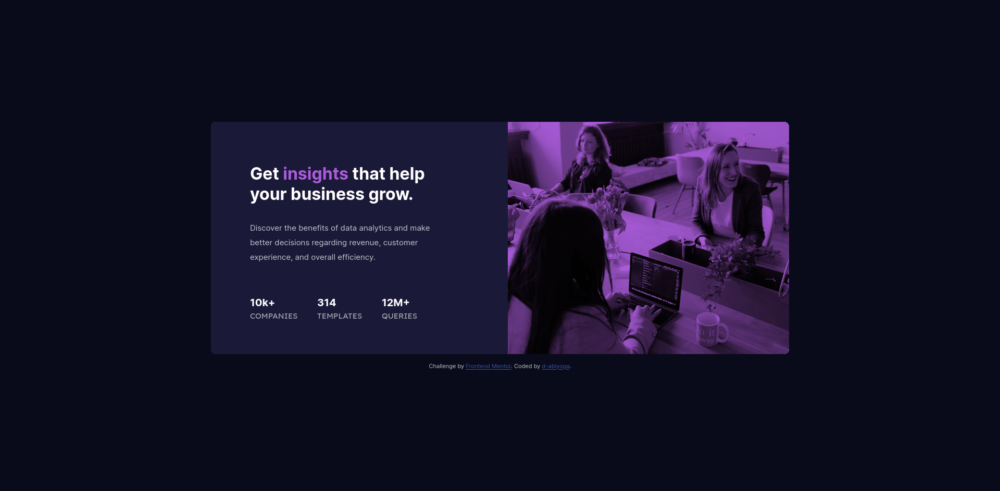

# Frontend Mentor - Stats preview card component solution

This is a solution to the [Stats preview card component challenge on Frontend Mentor](https://www.frontendmentor.io/challenges/stats-preview-card-component-8JqbgoU62). Frontend Mentor challenges help you improve your coding skills by building realistic projects. 

## Table of contents

- [Overview](#overview)
  - [The challenge](#the-challenge)
  - [Screenshot](#screenshot)
  - [Links](#links)
- [My process](#my-process)
  - [Built with](#built-with)
  - [What I learned](#what-i-learned)
  - [Continued development](#continued-development)
  - [Useful resources](#useful-resources)
- [Author](#author)
- [Acknowledgments](#acknowledgments)

**Note: Delete this note and update the table of contents based on what sections you keep.**

## Overview
This is my first time to do a challenge using React after I complete react tutorials in freecodecamp. I know this challenge is really simple, but I need to hone my skill to use react.

### The challenge

Users should be able to:

- View the optimal layout depending on their device's screen size

### Screenshot



### Links

<!-- - Solution URL: [Add solution URL here](https://your-solution-url.com) -->
- Live Site URL: [Live website](https://brave-goldwasser-58e8d3.netlify.app)

## My process

### Built with

- Semantic HTML5 markup
- Flexbox
- [React](https://reactjs.org/) - JS library

### What I learned

Generally, I learned to create simple component using React. 

In CSS, I learned that we can use background image blend to make an image tinted with some color. I thought I can use filter property in image element to make some tint in an image. But until now I have not found solution for that.

Another solution is we may create some tint using pseudo class `some-css-class:before` and overlay it with some color. But I found that I cannot get good contrast when using this solution. Following is some snippets of how the solution applied.
```css
.tint:before {
  color: voilet;
  transparency: 0.5;
  
  position: absolute;
  display: block;
  top: 0;
  left: 0;
  bottom: 0;
  right: 0;

  z-index: 1
}

```

## Author
- Frontend Mentor - [@d-abiyoga](https://www.frontendmentor.io/profile/d-abiyoga)
