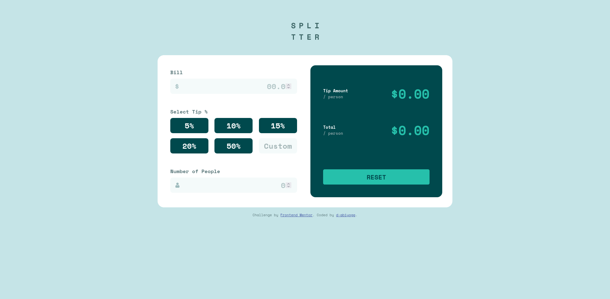

# Frontend Mentor - Stats preview card component solution

This is a solution to the [Stats preview card component challenge on Frontend Mentor](https://www.frontendmentor.io/challenges/stats-preview-card-component-8JqbgoU62). Frontend Mentor challenges help you improve your coding skills by building realistic projects. 

## Table of contents

- [Overview](#overview)
  - [The challenge](#the-challenge)
  - [Screenshot](#screenshot)
  - [Links](#links)
- [My process](#my-process)
  - [Built with](#built-with)
  - [What I learned](#what-i-learned)
  - [Continued development](#continued-development)
  - [Useful resources](#useful-resources)
- [Author](#author)

## Overview
This is my first time to fiddle with form in React.js. I am stil struggled with implementation of partial state updating which is done through setState and its asynchronous nature.

### The challenge
Users should be able to:

- View the optimal layout for the app depending on their device's screen size
- See hover states for all interactive elements on the page
- Calculate the correct tip and total cost

### Screenshot

### Links
<!-- - Solution URL: [Add solution URL here](https://your-solution-url.com) -->
- Live Site URL: [Live website  hosted in Netlify](https://adoring-snyder-c43987.netlify.app/)

## My process

### Built with

- Semantic HTML5 markup
- Flexbox
- Mobile-first workflow
- [React](https://reactjs.org/) - JS library

### What I learned

I learned that mobile-first workflow tend to make the work faster. I suspect that it caused by mobile design / version usually have less feature, so what we do in desktop design is adding some feature and adjusting layouts.

I learn how to deal with useState and useEffect hooks. But still I have not understand yet about partial update state using setState. Let's say I want to update two object value within one function. Due to setState work asynchronously, it will only update 1 object value.

In this challenge, in the tip input form, it is logical to use radio button. However, we need to accommodate the custom tip input from users. Thus, I need to create a function that clear selection of radio button when custom tip is selected (see function named `clearSelectedTip`).

### Useful Resources
I learned how to do form validation from [this  youtube video](https://www.youtube.com/watch?v=4CeTFW4agRw&t=2537s).

## Author
- Frontend Mentor - [@d-abiyoga](https://www.frontendmentor.io/profile/d-abiyoga)